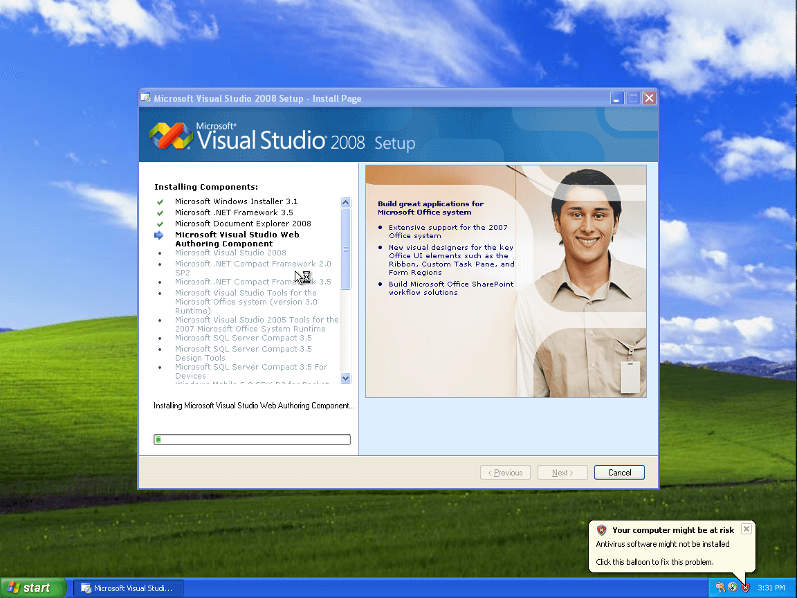
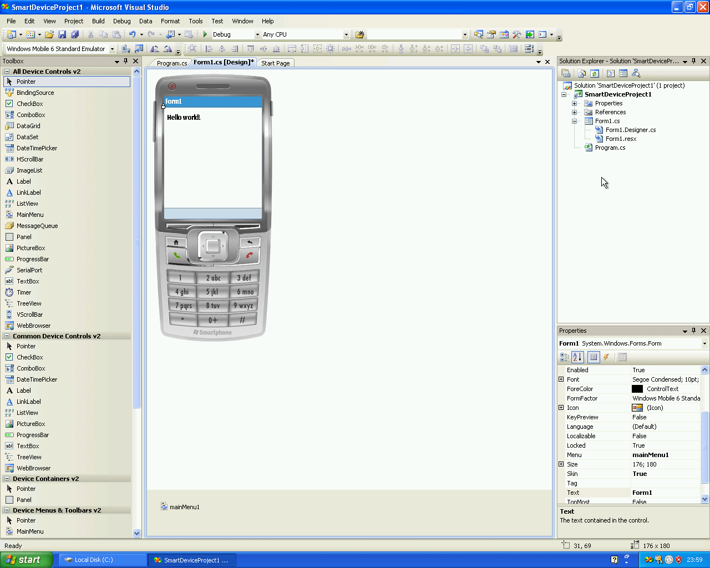

+++
title = "Development on an Ancient Windows Mobile Phone"
slug = "development-on-an-ancient-windows-mobile-phone"
date = "2023-07-06"
description = "Running hello world application inside a phone that is running Windows Mobile 6 Standard"
images = [ "index.jpg" ]
tags = [
    "development",
    "windows mobile",
]
+++

I've had this Crea MS2 phone that's been lying around for a while. One boring afternoon and I started to think that maybe I can do something with it. I've actually used it way back then and I was excited to see a phone that can run fully fledged Windows, but yeah, I've had my hopes up too much because I quickly realized it was running a mobile version of it.

Little bit of Google search leads me to this page; [Windows Mobile 6 Professional and Standard Software Development Kits Refresh](https://www.microsoft.com/en-us/download/details.aspx?id=6135).

Apparently I need the Windows Mobile 6 Standard SDK to do development on it, which makes sense. I also need Windows XP SP2- because I don't want to deal with Windows Server 2003 nor Vista, Visual Studio 2008 Professional and ActiveSync 4.5.

Archive.org have both Windows XP and Visual Studio 2008. You can reach them [here](https://archive.org/details/Windows-XP-Professional-ISO-Version-2002-SP2-OEM-Disc-Image) and [here](https://archive.org/details/dev-microsoft-visual-studio-2005-2015-Pro).

About downloading stuff from archive.org, if you can use the torrent option, please do, to ease of some of the load on the archive.org servers.

I also had to find another license key for Windows XP because the one on the archive.org page didn't work, you can find it [here](https://gist.github.com/fuwn/e0f320abe52e9433f6c6a7b9256749e3#professional-oem).

I've had to use Generation 1 in Hyper-V for 32-bit operating system support.

After spinning up the VM, it was time to install Visual Studio 2008 Professional. This version of the image already had Microsoft .NET Compact Framework 2.0 SP2 which is an another requirement for development on this device.

Transferring files to the VM was a bit of a hassle. I needed to close the VM, delete the checkpoint, mount the VM's hard drive to my host machine, transfer the files onto there and then run the VM back, let it check the disk and voila, my files were there.

After that, I've managed to install Windows Mobile Standard 6 SDK and Active Sync 4.5.

I've followed through [this](https://www.codemag.com/article/0807071/Getting-Started-with-Windows-Mobile-Development) article to actually do some development.

Created a new Smart Device Project, selected the correct target platform and .NET Compact Framework version and there it was, a Windows Mobile Form application.

I thrown in a label, changed it's content and started to think about how I'm going to transfer it to my device.

I switched to Release compilation, built it, copied the exe file to root directory of the hard drive and closed off the VM, opened it again, and closed it again to make checkpoint happy.

After all, I didn't needed the active sync application. All I had to do on the phone was to go to Settings -> Connections -> USB Mass Storage and enable the mass storage option. After that I could see the drive on my machine.

Lastly, I ran it on the phone, and there it was!

Half of the hassle was to get in line with Hyper-V, but now that I have successfully setup the development environment, maybe I'll do these steps on an actual machine and do some things there.